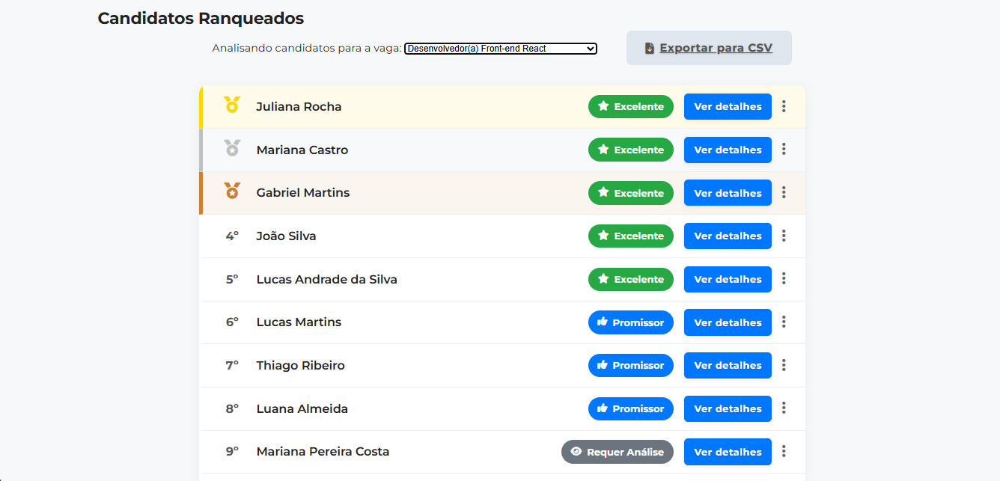

# 🚀 CK ATS — Triagem Inteligente de Currículos com IA

<div align="center">

### Plataforma ATS Inteligente com IA para Automação de Recrutamento

**Autor:** Arthur Paulo de Carvalho
**Versão:** SaaS Portfólio V1
**Status:** ✅ Protótipo Funcional Concluído

<br>



</div>

---

# 📌 Sobre o Projeto

O **CK ATS** é uma plataforma de recrutamento inteligente (**ATS — Applicant Tracking System**) desenvolvida para automatizar e otimizar processos de triagem de currículos utilizando Inteligência Artificial.

O projeto nasceu para solucionar um dos maiores desafios do setor de RH:

* Alto volume de currículos
* Processos manuais demorados
* Baixa eficiência operacional
* Subjetividade na seleção inicial

A solução utiliza um **LLM (Large Language Model)** através da API do **Google Gemini** para:

✅ Extrair informações automaticamente dos currículos
✅ Estruturar dados dos candidatos
✅ Calcular um índice de adequação para cada vaga
✅ Ranquear os candidatos mais compatíveis
✅ Facilitar decisões estratégicas do RH

O objetivo do sistema **não é substituir recrutadores**, mas sim transformar horas de triagem operacional em minutos de análise inteligente focada nos melhores talentos.

---

# ✨ Funcionalidades Principais

## 📂 Gestão de Vagas

* Criação de vagas
* Listagem de vagas
* Exclusão de vagas
* Cadastro manual de habilidades
* Sugestão automática de habilidades com IA

### 🤖 Sugestão Inteligente de Skills

O sistema analisa a descrição da vaga e sugere automaticamente:

* Hard Skills
* Soft Skills
* Tecnologias relevantes
* Competências comportamentais

---

## 👨‍💼 Processamento Inteligente de Currículos

### 📤 Upload em Massa

Envio simultâneo de múltiplos currículos nos formatos:

* `.pdf`
* `.docx`

### 🧠 Extração de Dados com IA

A IA realiza parsing automático e estruturado de:

* Nome
* Contato
* Formação acadêmica
* Experiência profissional
* Habilidades
* Idiomas
* Certificações

### 🔒 Prevenção de Duplicatas

O sistema utiliza hash do arquivo para impedir processamento duplicado de currículos.

---

# 🏆 Ranking Inteligente de Candidatos

## 📊 Índice de Adequação

O CK ATS calcula automaticamente uma pontuação baseada em:

* Compatibilidade de habilidades
* Experiência profissional
* Formação acadêmica
* Requisitos da vaga

---

## 🎯 Níveis de Compatibilidade

Os candidatos são classificados visualmente em:

| Nível             | Descrição                |
| ----------------- | ------------------------ |
| 🟢 Excelente      | Alta compatibilidade     |
| 🟡 Promissor      | Compatibilidade moderada |
| 🔴 Requer Análise | Baixa compatibilidade    |

---

## 🥇 Visualização em Pódio

O sistema destaca os **Top 3 candidatos** utilizando uma interface inspirada em pódios de corrida, permitindo identificação imediata dos melhores talentos.

---

# 📈 Dashboard & Analytics

O sistema apresenta métricas estratégicas como:

* Total de candidatos cadastrados
* Média de compatibilidade
* Distribuição de pontuações
* Habilidades mais frequentes
* Insights da base de talentos

---

# ⚙️ Ações de RH

O recrutador pode:

✅ Aprovar candidatos
✅ Reprovar candidatos
✅ Excluir candidatos
✅ Agendar entrevistas
✅ Exportar dados para CSV

---

# 🏗️ Arquitetura e Tecnologias

## 🔙 Backend

* Python 3
* Flask

## 🤖 Inteligência Artificial

* Google Gemini API (`google-genai`)

## 🗄️ Banco de Dados

* SQLite 3 *(V1)*
* MySQL *(em implementação na V2)*

### Segurança aplicada:

* Queries parametrizadas
* Proteção contra SQL Injection

---

## 🎨 Frontend

* HTML5
* CSS3
* JavaScript Vanilla

---

## 🔐 Segurança

* `python-dotenv`
* Variáveis de ambiente
* `SECRET_KEY` do Flask

---

# 📚 Bibliotecas Utilizadas

```txt
PyPDF2
python-docx
google-genai
Flask
python-dotenv
sqlite3
```

---

# 🚀 Como Executar o Projeto

# 📋 Pré-requisitos

* Python 3.8+
* Pip instalado

---

# 🔧 Instalação

## 1️⃣ Clone o repositório

```bash
git clone https://github.com/ArthurCarvallho/CKATSV1.git
cd CKATSV1
```

---

## 2️⃣ Crie um ambiente virtual

### Windows

```bash
python -m venv venv
venv\Scripts\activate
```

### Linux/macOS

```bash
python -m venv venv
source venv/bin/activate
```

---

## 3️⃣ Instale as dependências

```bash
pip install -r requirements.txt
```

---

# 🔐 Configuração do `.env`

Crie um arquivo chamado `.env` na raiz do projeto:

```env
GEMINI_API_KEY=sua_chave_do_google_aqui
SECRET_KEY=uma_chave_secreta_inventada_por_voce
```

⚠️ Nunca coloque aspas nas chaves.

---

# ▶️ Execução

Inicie o servidor Flask:

```bash
python app.py
```

---

# 🌐 Estrutura do Projeto

```txt
CKATSV1/
│
├── static/
│   ├── css/
│   ├── js/
│   └── img/
│
├── templates/
│
├── uploads/
│
├── app.py
├── requirements.txt
├── .env
└── README.md
```

---

# 🚀 Roadmap — CK ATS V2

A próxima versão do projeto está focada em:

## 🏢 Fase 1 — Arquitetura SaaS Multi-Tenant

Implementação de:

* Isolamento por `ID_EMPRESA`
* Estrutura B2B
* Controle de assinaturas
* Segurança entre empresas

Objetivo:
Garantir que os dados da Empresa A sejam totalmente isolados da Empresa B.

---

## 🗄️ Fase 2 — Migração para MySQL

Substituição do SQLite por:

✅ MySQL em produção

Além disso:

* Reestruturação do backend
* Criação do `DatabaseManager`
* SQL manual puro
* Melhor performance
* Maior escalabilidade

---

## 🖥️ Fase 3 — Infraestrutura & DevOps

Deploy profissional utilizando:

* Ubuntu Server
* VirtualBox
* SSH
* Ambiente Linux
* Configuração de rede
* Deploy raiz

---

# 🎯 Objetivos do Projeto

* Demonstrar domínio Full Stack
* Aplicar IA em problemas reais
* Criar solução SaaS escalável
* Construir portfólio profissional
* Explorar arquitetura multi-tenant

---

# 📌 Status Atual

| Módulo         | Status                |
| -------------- | --------------------- |
| ATS Core       | ✅ Concluído           |
| Ranking IA     | ✅ Concluído           |
| Dashboard      | ✅ Concluído           |
| Exportação CSV | ✅ Concluído           |
| Multi-Tenant   | 🚧 Em desenvolvimento |
| MySQL          | 🚧 Em desenvolvimento |
| Deploy Linux   | 🚧 Em desenvolvimento |

---

# 👨‍💻 Autor

## Arthur Paulo de Carvalho

Projeto desenvolvido com foco em:

* Engenharia de Software
* Inteligência Artificial
* Arquitetura Backend
* SaaS B2B
* Automação de RH

---

# ⭐ Considerações Finais

O **CK ATS** representa a união entre:

* IA aplicada
* Automação inteligente
* Arquitetura escalável
* Experiência de usuário moderna

O projeto evolui continuamente rumo a uma plataforma SaaS robusta e pronta para ambientes reais de recrutamento corporativo.

---

## 📄 Licença

Este projeto possui finalidade educacional e de portfólio.
